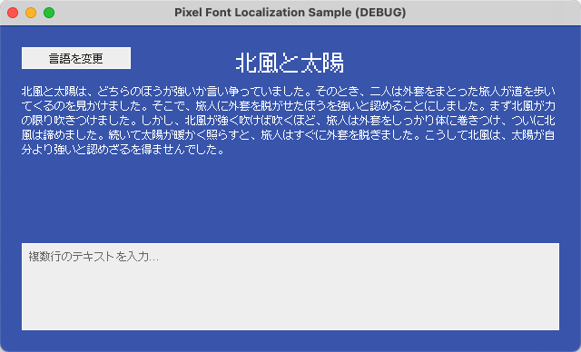
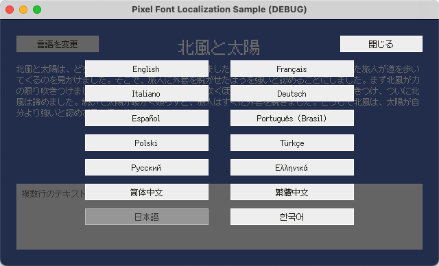

# Godot - ピクセルフォント多言語化サンプル

[English](README.md) | [简体中文](README.zh-Hans.md) | [繁體中文](README.zh-Hant.md) | 日本語 | [한국어](README.ko.md)

## 概要

このプロジェクトは、[Godot](https://github.com/godotengine/godot) で [Fusion Pixel Font](https://github.com/TakWolf/fusion-pixel-font) を使用する方法を示す公式リファレンスサンプルです。主に以下の内容を扱います。

- エンジン上でピクセルフォントを正しく描画する方法。
- シンプルで保守しやすいゲームの多言語化ワークフローの構築。
- 実行時に言語を切り替え、UI テキストと各言語に対応するフォントを同期して更新する方法。

このプロジェクトは、Godot のベストプラクティスに従いながら、実装をシンプルに保ち、仕組みを明確にすることを目指しています。

関連する技術の詳細を解説するチュートリアルも用意しています。

- [English](docs/tutorial.md)
- [简体中文](docs/tutorial.zh-Hans.md)
- [繁體中文](docs/tutorial.zh-Hant.md)
- [日本語](docs/tutorial.ja.md)
- [한국어](docs/tutorial.ko.md)

## 公式コミュニティ

- [Pixel Font Studio - Discord サーバー](https://discord.gg/3GKtPKtjdU)
- [Pixel Font Studio - QQ グループ](https://qm.qq.com/q/jPk8sSitUI)

## ライセンス

サンプルプロジェクトは [MIT License](LICENSE) のもとで提供されています。

このプロジェクトで使用している [Fusion Pixel Font](https://github.com/TakWolf/fusion-pixel-font) は、[SIL Open Font License version 1.1](assets/fonts/fusion-pixel/OFL.txt) のもとで提供されています。

サンプルテキストは [The North Wind and the Sun](https://github.com/TakWolf/the-north-wind-and-the-sun) プロジェクトから引用しており、[CC0 1.0 Universal](https://github.com/TakWolf/the-north-wind-and-the-sun/blob/master/LICENSE) のもとで提供されています。
