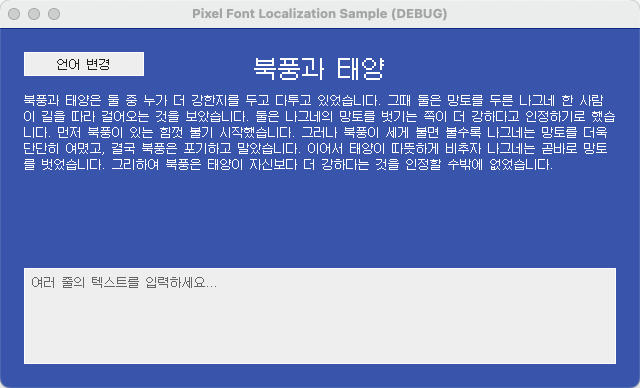
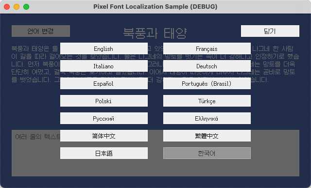

# Godot - 픽셀 폰트 현지화 예제

[English](README.md) | [简体中文](README.zh-Hans.md) | [繁體中文](README.zh-Hant.md) | [日本語](README.ja.md) | 한국어

## 개요

이 프로젝트는 [Godot](https://github.com/godotengine/godot)에서 [Fusion Pixel Font](https://github.com/TakWolf/fusion-pixel-font)를 사용하는 방법을 보여 주는 공식 참고 예제입니다. 주요 내용은 다음과 같습니다.

- 엔진에서 픽셀 폰트를 올바르게 렌더링합니다.
- 간단하고 유지 관리하기 쉬운 게임 현지화 워크플로를 구축합니다.
- 런타임에 언어를 전환하면서 UI 텍스트와 해당 언어의 폰트를 함께 업데이트합니다.

이 프로젝트는 Godot의 모범 사례를 따르면서 구현을 간결하게 유지하고 작동 방식을 명확하게 전달하는 것을 목표로 합니다.

관련 기술을 자세히 설명하는 튜토리얼도 제공합니다.

- [English](docs/tutorial.md)
- [简体中文](docs/tutorial.zh-Hans.md)
- [繁體中文](docs/tutorial.zh-Hant.md)
- [日本語](docs/tutorial.ja.md)
- [한국어](docs/tutorial.ko.md)

## 공식 커뮤니티

- [Pixel Font Studio - Discord 서버](https://discord.gg/3GKtPKtjdU)
- [Pixel Font Studio - QQ 그룹](https://qm.qq.com/q/jPk8sSitUI)

## 라이선스

예제 프로젝트는 [MIT License](LICENSE)에 따라 배포됩니다.

이 프로젝트에서 사용하는 [Fusion Pixel Font](https://github.com/TakWolf/fusion-pixel-font)는 [SIL Open Font License version 1.1](assets/fonts/fusion-pixel/OFL.txt)에 따라 배포됩니다.

예제 텍스트는 [The North Wind and the Sun](https://github.com/TakWolf/the-north-wind-and-the-sun) 프로젝트에서 가져왔으며 [CC0 1.0 Universal](https://github.com/TakWolf/the-north-wind-and-the-sun/blob/master/LICENSE)에 따라 배포됩니다.
