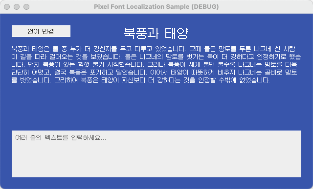
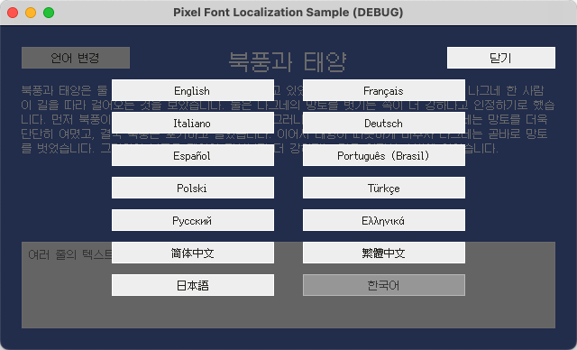

# Godot - 픽셀 폰트 현지화 예제

[English](README.md) | [简体中文](README.zh-Hans.md) | [繁體中文](README.zh-Hant.md) | [日本語](README.ja.md) | 한국어

## 개요

이 프로젝트는 [Godot](https://github.com/godotengine/godot)에 픽셀 폰트 [Fusion Pixel Font](https://github.com/TakWolf/fusion-pixel-font)를 통합하고 유지 관리하기 쉬운 현지화 워크플로를 구축하는 방법을 보여 줍니다.

- 올바른 폰트 가져오기 설정을 사용하여 픽셀 폰트를 설계 크기와 그 정수 배 크기에서 선명하게 표시합니다.
- CSV 번역 테이블로 UI와 예제 텍스트를 관리하여 유지 관리하기 쉬운 게임 현지화 워크플로를 구축합니다.
- 런타임 언어 전환을 지원하며, 현지화 텍스트를 업데이트하는 동시에 언어 또는 지역에 맞는 폰트 리소스를 로드하여 중국어 간체, 중국어 번체, 일본어, 한국어의 동일 코드 포인트에 대한 언어별 글리프 차이를 올바르게 표시합니다.

이 예제는 구현을 간결하게 유지하고 Godot의 모범 사례를 따릅니다.

## 공식 커뮤니티

- [Pixel Font Studio - Discord 서버](https://discord.gg/3GKtPKtjdU)
- [Pixel Font Studio - QQ 그룹](https://qm.qq.com/q/jPk8sSitUI)

## 라이선스

예제 프로젝트는 [MIT License](LICENSE)에 따라 배포됩니다.

이 프로젝트에서 사용하는 [Fusion Pixel Font](https://github.com/TakWolf/fusion-pixel-font)는 [SIL Open Font License version 1.1](assets/fonts/fusion-pixel/OFL.txt)에 따라 배포됩니다.

예제 텍스트는 [The North Wind and the Sun](https://github.com/TakWolf/the-north-wind-and-the-sun) 프로젝트에서 가져왔으며 [CC0 1.0 Universal](https://github.com/TakWolf/the-north-wind-and-the-sun/blob/master/LICENSE)에 따라 배포됩니다.
