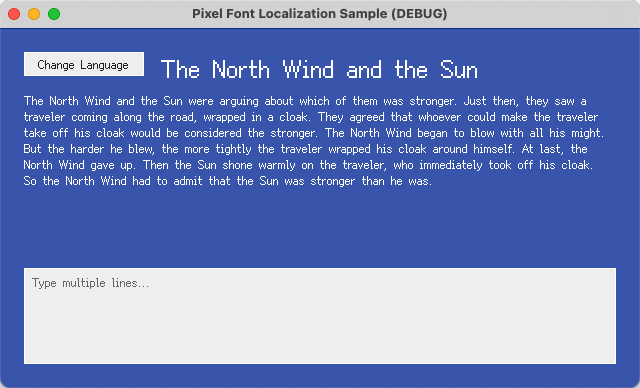
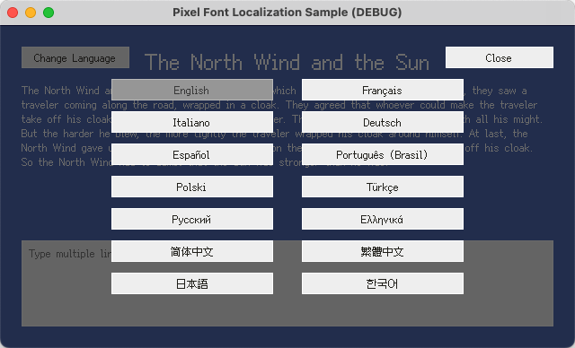

# Godot - Pixel Font Localization Sample

English | [简体中文](README.zh-Hans.md) | [繁體中文](README.zh-Hant.md) | [日本語](README.ja.md) | [한국어](README.ko.md)

## Overview

This project is the official reference sample demonstrating how to use [Fusion Pixel Font](https://github.com/TakWolf/fusion-pixel-font) in [Godot](https://github.com/godotengine/godot). It primarily covers the following topics:

- Rendering pixel fonts correctly in the engine.
- Establishing a simple and maintainable game localization workflow.
- Switching languages at runtime while updating the UI text and language-specific font in sync.

The project aims to keep the implementation simple and the approach clear while following Godot best practices.

Companion tutorials are also available with detailed explanations of the relevant technical concepts:

- [English](docs/tutorial.md)
- [简体中文](docs/tutorial.zh-Hans.md)
- [繁體中文](docs/tutorial.zh-Hant.md)
- [日本語](docs/tutorial.ja.md)
- [한국어](docs/tutorial.ko.md)

## Official Community

- [Pixel Font Studio - Discord Server](https://discord.gg/3GKtPKtjdU)
- [Pixel Font Studio - QQ Group](https://qm.qq.com/q/jPk8sSitUI)

## License

The sample project is licensed under the [MIT License](LICENSE).

The [Fusion Pixel Font](https://github.com/TakWolf/fusion-pixel-font) used by this project is licensed under the [SIL Open Font License, Version 1.1](assets/fonts/fusion-pixel/OFL.txt).

The sample text is sourced from [The North Wind and the Sun](https://github.com/TakWolf/the-north-wind-and-the-sun) project and is licensed under [CC0 1.0 Universal](https://github.com/TakWolf/the-north-wind-and-the-sun/blob/master/LICENSE).
