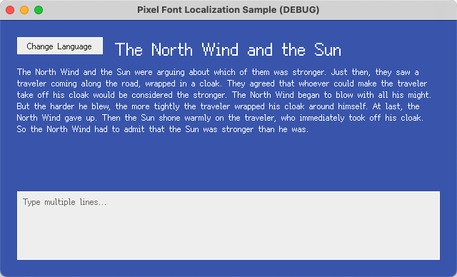
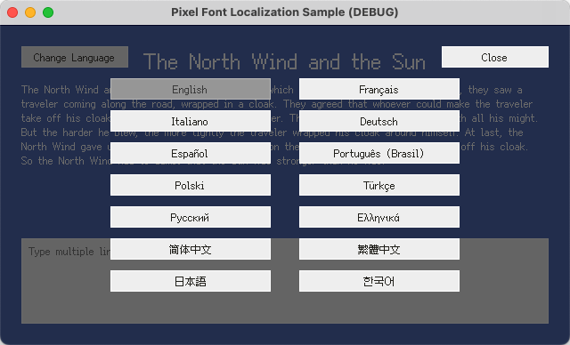

# Godot - Pixel Font Localization Sample

English | [简体中文](README.zh-Hans.md) | [繁體中文](README.zh-Hant.md) | [日本語](README.ja.md) | [한국어](README.ko.md)

## Overview

This project demonstrates how to integrate [Fusion Pixel Font](https://github.com/TakWolf/fusion-pixel-font) in [Godot](https://github.com/godotengine/godot) and establish a maintainable localization workflow.

Built with Godot 4.7.

It uses Gettext PO files for localized strings, with separate `sample` and `ui` translation domains. Runtime locale switching is performed via `TranslationServer` with closest supported locale matching.

When the locale is switched, the matching font is dynamically selected through Godot's translation remap mechanism. This correctly handles CJK Unicode unification, where the same codepoint may have different glyph forms across languages, as well as the difference between CJK and Western punctuation.

To ensure correct pixel rendering, the font is imported with antialiasing, hinting, and subpixel positioning disabled, mipmaps off, and system font fallback disabled, using the design size directly without oversampling.

## References

- [Godot Engine Documentation - Internationalization](https://docs.godotengine.org/en/stable/tutorials/i18n/)

## Official Community

- [Pixel Font Studio - Discord Server](https://discord.gg/3GKtPKtjdU)
- [Pixel Font Studio - QQ Group](https://qm.qq.com/q/jPk8sSitUI)

## License

The sample project is licensed under the [MIT License](LICENSE).

The [Fusion Pixel Font](https://github.com/TakWolf/fusion-pixel-font) used by this project is licensed under the [SIL Open Font License, Version 1.1](assets/fonts/fusion-pixel/OFL.txt).

The sample text is sourced from [The North Wind and the Sun](https://github.com/TakWolf/the-north-wind-and-the-sun) project and is licensed under [CC0 1.0 Universal](https://github.com/TakWolf/the-north-wind-and-the-sun/blob/master/LICENSE).
