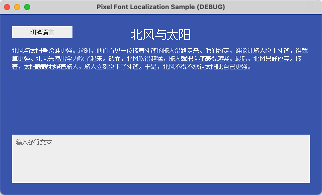
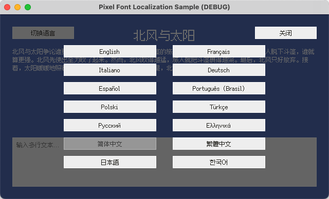

# Godot - 像素字体本地化示例

[English](README.md) | 简体中文 | [繁體中文](README.zh-Hant.md) | [日本語](README.ja.md) | [한국어](README.ko.md)

## 概述

本项目是演示 [Fusion Pixel Font](https://github.com/TakWolf/fusion-pixel-font) 在 [Godot](https://github.com/godotengine/godot) 中使用的官方参考示例，主要包含以下内容：

- 在引擎中正确渲染像素字体。
- 建立简单且易于维护的游戏本地化工作流。
- 在运行时切换语言，同步更新界面文本和对应语言的字体。

项目力求保持实现简单、思路清晰，并遵循 Godot 的最佳实践。

我们还提供了配套教程，详细介绍相关技术细节：

- [English](docs/tutorial.md)
- [简体中文](docs/tutorial.zh-Hans.md)
- [繁體中文](docs/tutorial.zh-Hant.md)
- [日本語](docs/tutorial.ja.md)
- [한국어](docs/tutorial.ko.md)

## 官方社区

- [像素字体工房 - Discord 服务器](https://discord.gg/3GKtPKtjdU)
- [像素字体工房 - QQ 群](https://qm.qq.com/q/jPk8sSitUI)

## 许可证

示例项目采用 [MIT License](LICENSE) 授权。

项目使用的 [Fusion Pixel Font](https://github.com/TakWolf/fusion-pixel-font) 遵循 [SIL Open Font License version 1.1](assets/fonts/fusion-pixel/OFL.txt) 授权。

示例文本来自 [The North Wind and the Sun](https://github.com/TakWolf/the-north-wind-and-the-sun) 项目，遵循 [CC0 1.0 Universal](https://github.com/TakWolf/the-north-wind-and-the-sun/blob/master/LICENSE) 授权。
