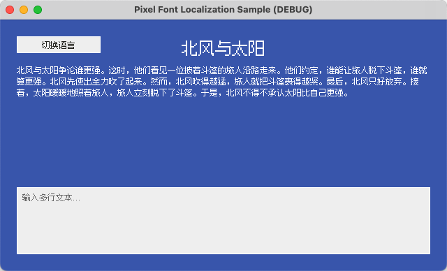
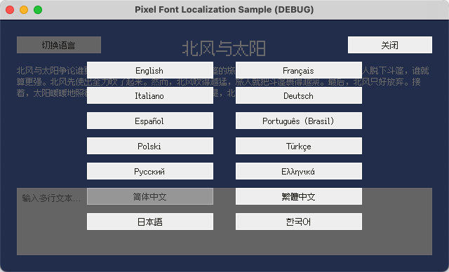

# Godot - 像素字体本地化示例

[English](README.md) | 简体中文 | [繁體中文](README.zh-Hant.md) | [日本語](README.ja.md) | [한국어](README.ko.md)

## 概述

本项目演示如何在 [Godot](https://github.com/godotengine/godot) 中集成像素字体 [Fusion Pixel Font](https://github.com/TakWolf/fusion-pixel-font) 并建立可维护的本地化流程。

- 使用正确的字体导入配置，保持像素字体在设计字号及整数倍字号下的清晰显示。
- 通过 CSV 翻译表管理界面和示例文本，建立易于维护的游戏本地化工作流。
- 支持运行时切换语言，更新本地化文本的同时按语言或区域加载对应的字体资源，以正确显示简体中文、繁体中文、日语和韩语的同码异形字。

示例保持实现简洁，并遵循 Godot 的最佳实践。

## 官方社区

- [像素字体工房 - Discord 服务器](https://discord.gg/3GKtPKtjdU)
- [像素字体工房 - QQ 群](https://qm.qq.com/q/jPk8sSitUI)

## 许可证

示例项目采用 [MIT License](LICENSE) 授权。

项目使用的 [Fusion Pixel Font](https://github.com/TakWolf/fusion-pixel-font) 遵循 [SIL Open Font License version 1.1](assets/fonts/fusion-pixel/OFL.txt) 授权。

示例文本来自 [The North Wind and the Sun](https://github.com/TakWolf/the-north-wind-and-the-sun) 项目，遵循 [CC0 1.0 Universal](https://github.com/TakWolf/the-north-wind-and-the-sun/blob/master/LICENSE) 授权。
