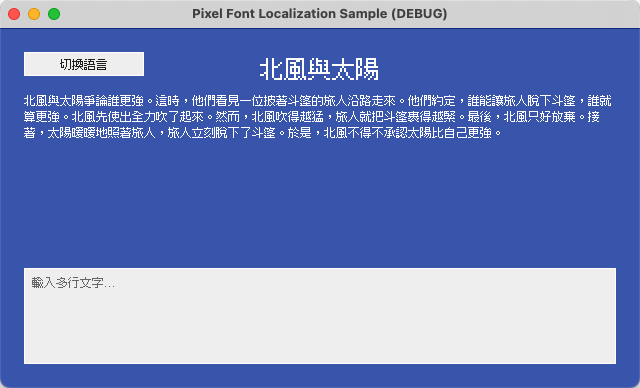
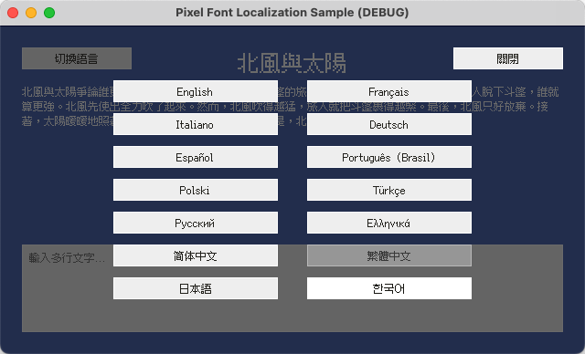

# Godot - 像素字體本地化範例

[English](README.md) | [简体中文](README.zh-Hans.md) | 繁體中文 | [日本語](README.ja.md) | [한국어](README.ko.md)

## 概述

本專案是示範如何在 [Godot](https://github.com/godotengine/godot) 中使用 [Fusion Pixel Font](https://github.com/TakWolf/fusion-pixel-font) 的官方參考範例，主要包含以下內容：

- 在引擎中正確渲染像素字體。
- 建立簡單且易於維護的遊戲本地化工作流程。
- 在執行階段切換語言，同步更新介面文字和對應語言的字體。

專案力求維持實作簡單、思路清晰，並遵循 Godot 的最佳實務。

我們也提供了配套教學，詳細介紹相關技術細節：

- [English](docs/tutorial.md)
- [简体中文](docs/tutorial.zh-Hans.md)
- [繁體中文](docs/tutorial.zh-Hant.md)
- [日本語](docs/tutorial.ja.md)
- [한국어](docs/tutorial.ko.md)

## 官方社群

- [像素字體工房 - Discord 伺服器](https://discord.gg/3GKtPKtjdU)
- [像素字體工房 - QQ 群](https://qm.qq.com/q/jPk8sSitUI)

## 授權條款

範例專案採用 [MIT License](LICENSE) 授權。

專案使用的 [Fusion Pixel Font](https://github.com/TakWolf/fusion-pixel-font) 遵循 [SIL Open Font License version 1.1](assets/fonts/fusion-pixel/OFL.txt) 授權。

範例文字來自 [The North Wind and the Sun](https://github.com/TakWolf/the-north-wind-and-the-sun) 專案，遵循 [CC0 1.0 Universal](https://github.com/TakWolf/the-north-wind-and-the-sun/blob/master/LICENSE) 授權。
