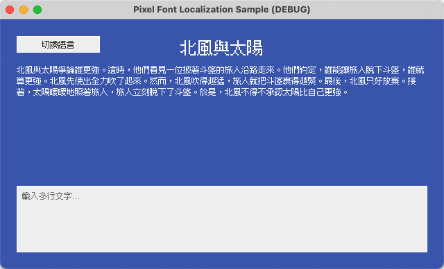
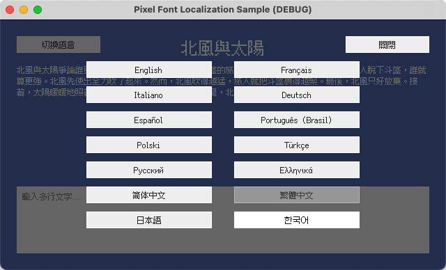

# Godot - 像素字體本地化範例

[English](README.md) | [简体中文](README.zh-Hans.md) | 繁體中文 | [日本語](README.ja.md) | [한국어](README.ko.md)

## 概述

本專案示範在 [Godot](https://github.com/godotengine/godot) 中整合 [Fusion Pixel Font](https://github.com/TakWolf/fusion-pixel-font) 並建立可維護的本地化流程。

基於 Godot 4.7 建構。

使用 Gettext PO 檔案處理本地化字串，分為 `sample` 和 `ui` 兩個翻譯域。執行階段透過 `TranslationServer` 切換語言，並匹配最接近的支援語言。

切換語言時，會透過 Godot 的翻譯重映射機制動態切換匹配的字體。這樣可以正確處理 CJK 中 Unicode 同碼異形問題，以及中西文標點符號不一樣的問題。

為保證正確的像素化渲染，字體匯入時關閉了抗鋸齒、字體微調（hinting）和子像素定位，禁用多級漸遠紋理（mipmap）和系統字體回退，並直接使用設計字號，不做過取樣。

## 參考資料

- [Godot Engine Documentation - Internationalization](https://docs.godotengine.org/en/stable/tutorials/i18n/)

## 官方社群

- [像素字體工房 - Discord 伺服器](https://discord.gg/3GKtPKtjdU)
- [像素字體工房 - QQ 群](https://qm.qq.com/q/jPk8sSitUI)

## 授權條款

範例專案採用 [MIT License](LICENSE) 授權。

專案使用的 [Fusion Pixel Font](https://github.com/TakWolf/fusion-pixel-font) 遵循 [SIL Open Font License version 1.1](assets/fonts/fusion-pixel/OFL.txt) 授權。

範例文字來自 [The North Wind and the Sun](https://github.com/TakWolf/the-north-wind-and-the-sun) 專案，遵循 [CC0 1.0 Universal](https://github.com/TakWolf/the-north-wind-and-the-sun/blob/master/LICENSE) 授權。
